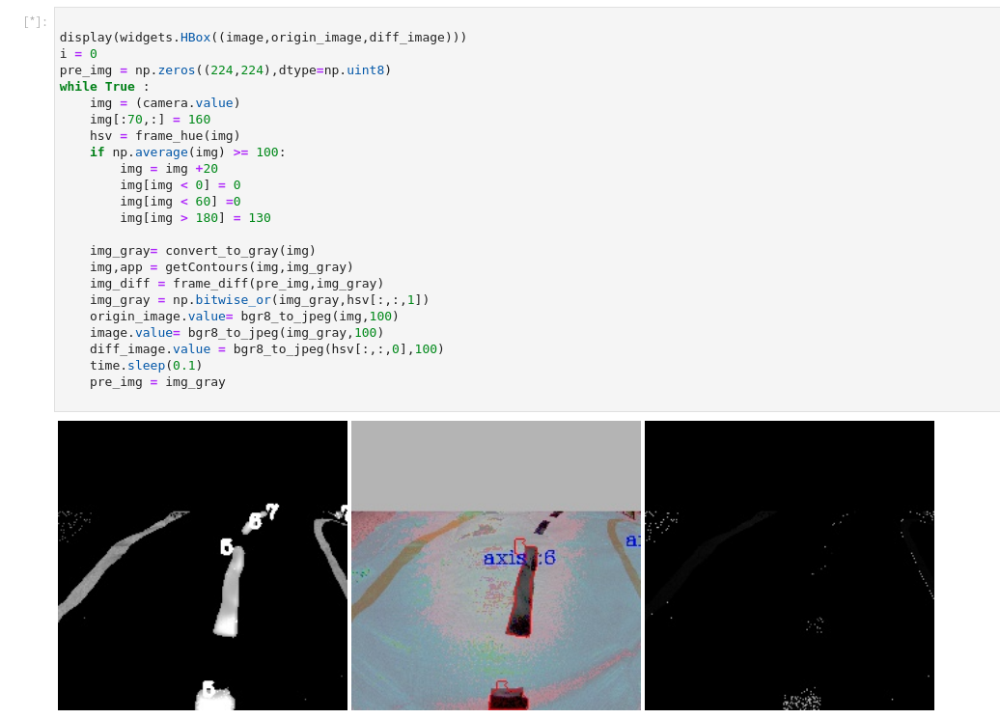
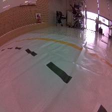

# JetBot

<!--[](https://discord.gg/Ady6NtF) -->

> Looking for a quick way to get started with JetBot?  Many third party kits are [now available](../../wiki/third-party-kits)!


JetBot is an open-source robot based on NVIDIA Jetson Nano that is

* **Affordable** - Less than $150 add-on to Jetson Nano
* **Educational** - Tutorials from basic motion to AI based collision avoidance
* **Fun!** - Interactively programmed from your web browser

Building and using JetBot gives the hands on experience needed to create entirely new AI projects.

To get started, read the [JetBot Wiki](https://github.com/NVIDIA-AI-IOT/jetbot/wiki).


[](https://github.com/igrigorik/ga-beacon)


## jetbot 자율주행 프로젝트
<Br><br>

  
**팀명 - 논 키보드(NoneKeyboard)**

*   조장 - 조국현
*   팀웜 - 손상훈
*   팀원 - 황문섭

<br><br>

----

## INDEX
*    ### 개발 환경
*    ### 상세 내용

<br>

```
본 프로젝트는 자율주행을 구현 한 것입니다.

    1. ML, 장애물 통과 패턴 구현
    2.   
    3. Detecting

```
<br><br>

# 개발 환경
### - OS : Ubuntu 18.04
### - Language : Python
### - Tools : Jupyter, OpenCV

<br><br>

# 상세 내용
<br><br>

<br><br><br><br>

## 구성 화면
<br><br><br>
  
<br><br><br>

## 초안 구성
<br><br>
화면캡쳐 -> 이미지 변환 -> 디텍팅 -> Model 학습 ->  ML 장애물 회피 및 lines tracking -> 주행<br>
<br><br>

## 화면캡쳐 
<br><br>

<br><br>

## 코드 구조 및 Frame 변환, lines detecting

<br><br>

## 구동영상 
<iframe width="560" height="315" src=" " frameborder="0" allow="accelerometer; autoplay; clipboard-write; encrypted-media; gyroscope; picture-in-picture" allowfullscreen></iframe> 